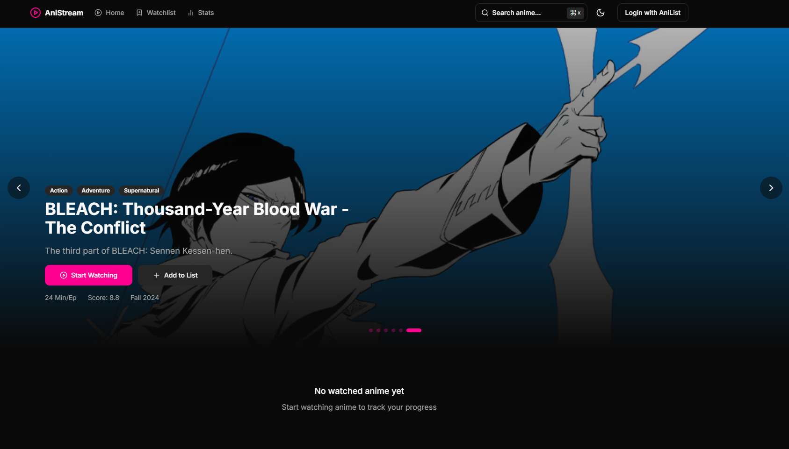

    
    <h1 align="center">tsune</h1>

Simple and easy to use open source anime streaming site without ads.

     
    
    
    

 

# Why should you choose tsune?

- **🚀 Fast:** Smooth and quick streaming with minimal buffering.
- **🎨 Sleek UI:** User-friendly and eye-catching.
- **🔄 Reliable:** Regular updates and fresh content.

 

# Languages

The languages where both the sub and dub don't work are implemented in the app, but they aren't selectable.

| Source     | Languages                                                        | Sub  | Dub | In-App name |
| ---------- | ---------------------------------------------------------------- | ---  | ----| ---------   |
| Gogoanime  | English                                                          | ✅   | ✅   | 🇺🇸 English     |
| HiAnime    | English, Arabic, French, German, Portuguese, Russian, Spanish... | ✅   | ❌   | 🌍 Universal   |
| AnimeUnity | Italian                                                          | ✅   | ✅   | 🇮🇹 Italian     |
|
| AnimeDrive | Hungarian                                                        | ❌   | ❌   | 🇭🇺 Hungarian   |

> Note: HiAnime doesn't always provide all the languages!

> Note: Currently still in alpha and under active developement